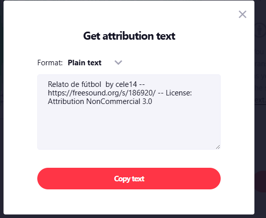

# KIT LEGAL MULTIMEDIA  
## Plataforma Web Interactiva para Análisis y Simulación Táctica del Fútbol Profesional  

---

### Institución
Unidades Tecnológicas de Santander  

### Programa
Tecnología en Desarrollo de Sistemas Informáticos  

### Asignatura
Desarrollo de Contenidos Digitales y Multimediales  

### Docente
Eliecer Montero Ojeda  

### Integrantes
- Edwing Stiven Mejía Sáenz  
- Jose Luis Olachica Velasco  

### Fecha
16/02/2026  

---

# 1. Imagen WebP

### Información del recurso

**Título:** Vista Aérea Del Estadio De Fútbol De Jönköping, Suecia  
**Autor:** Efrem Efre  
**Fuente:** Pexels  
**Enlace:** https://www.pexels.com/es-es/foto/vista-aerea-del-estadio-de-futbol-de-jonkoping-suecia-35065674/  
**Formato:** .webp  

---

### Tipo de licencia

Licencia Pexels  

Permite:
- Uso gratuito
- Uso académico
- Uso comercial
- No requiere atribución obligatoria
- No permite reventa individual del archivo

---

### Captura de verificación

---

### Justificación de uso

La imagen será utilizada como base visual principal para la simulación táctica dentro de la plataforma web.  
Su vista aérea permite representar formaciones estratégicas, posicionamiento de jugadores y análisis técnico del campo de juego.  

El recurso cumple con la licencia Pexels, garantizando su uso legal dentro del proyecto académico.

---

# 2. Audio MP3

### Información del recurso

**Título:** Relato de fútbol  
**Autor:** cele14  
**Fuente:** Freesound  
**Enlace:** https://freesound.org/s/186920/  
**Formato:** .mp3  

---

### Tipo de licencia

Creative Commons Attribution-NonCommercial 3.0 (CC BY-NC 3.0)

Permite:
- Uso académico
- Modificación
- Distribución con atribución
- No permite uso comercial

---

### Forma de atribución requerida

Audio: "Relato de fútbol" por cele14  
Fuente: Freesound  
Licencia: CC BY-NC 3.0  
Uso: Proyecto académico sin fines comerciales.

---

### Captura de verificación

---

### Justificación de uso

El audio será implementado como ambientación en la sección de simulación en vivo, generando una experiencia inmersiva similar a una transmisión profesional de fútbol.  

Se respeta la atribución obligatoria y se limita su uso a fines estrictamente académicos, cumpliendo los términos legales de la licencia.

---

# 3. Modelo 3D (GLTF / GLB)

### Información del recurso

**Autor:** Sergej Majboroda  
**Formato:** .gltf / .glb  

---

### Tipo de licencia

Creative Commons 0 (CC0)

Permite:
- Uso comercial
- Modificación
- Distribución
- No requiere atribución
- Uso libre sin restricciones

---

### Captura de verificación

---

### Justificación de uso

El modelo 3D será integrado en la sección interactiva de simulación táctica para enriquecer la representación visual del entorno deportivo.  

La licencia CC0 garantiza libertad total de uso, asegurando compatibilidad legal tanto para el desarrollo académico como para futuras implementaciones del sistema.

---

# Conclusión

Todos los recursos multimedia utilizados en el presente proyecto fueron seleccionados bajo licencias verificadas y compatibles con fines académicos.  

Se documentó cada fuente, se verificaron sus condiciones legales y se anexaron capturas como evidencia de cumplimiento normativo.  

El proyecto cumple con los principios de uso legal de contenido digital y buenas prácticas en desarrollo multimedia.
